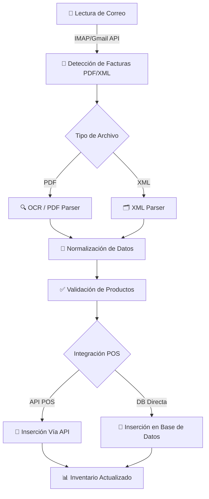

# 🤖 Automatización para Ingreso items al inventario

Este documento describe el flujo completo para automatizar la **carga de inventario** desde las facturas de proveedores al **POS** del cliente, evitando el ingreso manual.

---

## 🔹 1. Flujo de Proceso



---

## 🔹 2. Detalles del Flujo

### **1. Lectura de correo**
- Conexión a la cuenta del cliente (IMAP, Gmail API o Microsoft Graph).
- Filtrado de correos con **facturas adjuntas** (PDF/XML).

### **2. Extracción de datos**
- **PDF digital**: usar `pdfplumber` o `PyMuPDF` para leer texto.
- **PDF escaneado**: usar **OCR** con `pytesseract` o AWS Textract.
- **XML**: parsear con `xml.etree` o `lxml` para leer productos, cantidades y precios.

### **3. Normalización de datos**
- Estandarización de nombres de productos.
- Conversión de monedas y cantidades a formato interno del POS.
- Generación de un JSON listo para insertar, por ejemplo:

```json
{
  "invoice": "FAC-12345",
  "supplier": "Proveedor XYZ",
  "items": [
    { "item": "Café 500g", "quantity": 10, "unit_price": 2500 },
    { "item": "Azúcar 1kg", "quantity": 5, "unit_price": 1200 }
  ]
}
```

### **4. Validación de productos**
- Comprobar si el producto existe en el POS.
- Generar alerta o tabla de equivalencias para productos nuevos.

### **5. Inserción en el POS**
1. **Vía API (Recomendada)**
   - Se envía el JSON directamente al endpoint del POS.
   - Respeta todas las validaciones y triggers.
2. **Vía base de datos (Solo si no hay API)**
   - Insertar en tablas de **staging**.
   - Un proceso interno valida y mueve los datos al inventario oficial.

### **6. Actualización de Inventario**
- Los productos quedan registrados con:
  - **Cantidad** ingresada.
  - **Costo unitario y total**.
  - **Relación a la factura del proveedor**.

---

## 🔹 3. Beneficios del Sistema

- ✅ Elimina el ingreso manual de facturas.
- ✅ Reduce errores humanos en inventario.
- ✅ Procesamiento rápido de múltiples proveedores.
- ✅ Compatible con cualquier POS (API o DB directa).
- ✅ Historial y logs de todas las facturas procesadas.

---

## 🔹 4. Próximos Pasos

1. Validar si el **POS tiene API** para integrar.
2. Crear un **script de prueba** que lea 1 factura y genere JSON.
3. Configurar un **entorno seguro de staging** para pruebas.
4. Desplegar el servicio en un **servidor o contenedor**.

